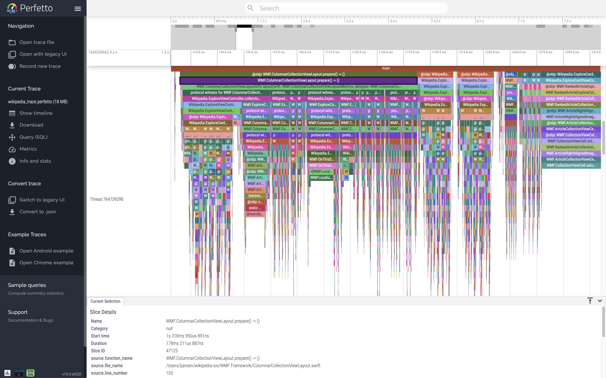

# Spoor

![Wikipedia iOS app boot trace][wikipedia-trace-png]

 

Spoor gives you deep insight into your application's performance. Its three-part
toolchain enables you to analyze your application down to the function call with
nanosecond precision and includes:

1. [Compiler instrumentation][reference-instrumentation] to auto-inject trace
   events.
2. A [runtime library][reference-runtime] to capture and buffer events.
3. [Tools][reference-postprocessing] to process and visualize the traces.

 

  [:material-run: Get started][get-started]{ .md-button .md-button--primary }

 

!!! warning "Project status"
    Spoor is still in its infancy and should be considered alpha-quality
    software. Please anticipate breaking changes,
    [report bugs][provide-feedback] that you encounter, and consider
    [contributing code][contribute-code] to support Spoor's development.

<figure markdown>
  
  <figcaption>
    Wikipedia's iOS app boot instrumented with Spoor and visualized with
    Perfetto.
  </figcaption>
</figure>

[contribute-code]: contributing/#contribute-code
[get-started]: get-started
[reference-instrumentation]: reference/instrumentation
[reference-postprocessing]: reference/postprocessing
[provide-feedback]: contributing/#provide-feedback
[wikipedia-trace-png]: wikipedia-ios-boot-trace.png
[reference-runtime]: reference/runtime
