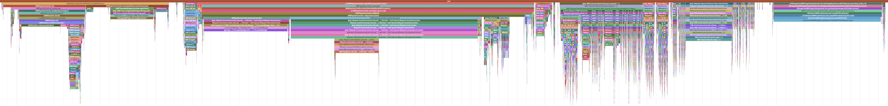

# Spoor

<h2><i>Your app's runtime like you've never seen it before</i></h2>

 

 

Spoor gives you deep insight into your application's performance. It is a
pipeline of tools to instrument and analyze your application down to the
function call with nanosecond precision.

1. Compiler instrumentation to auto-inject trace events.
2. A runtime library to capture and buffer events.
3. Tools to process and visualize the traces.

 

  [:material-run: Get started][get-started]{ .md-button .md-button--primary }

 

<figure markdown>
  
  <figcaption>
    Wikipedia's iOS app boot instrumented with Spoor and visualized with
    Perfetto.
  </figcaption>
</figure>

[get-started]: get-started/index.md
